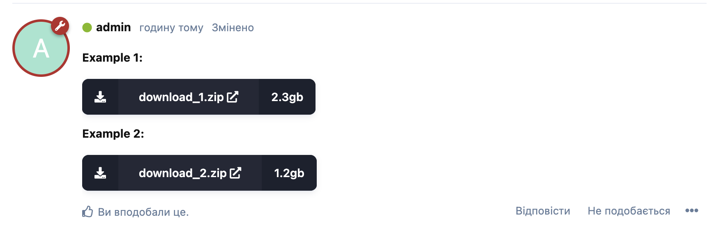

# Button Download
Add Download button with filename and size to your Flarum posts.
Add a Download button from the editor panel via BBCode.



[](https://packagist.org/packages/artemharbetskyi/flarum-bbcode-download-btn) [](https://packagist.org/packages/artemharbetskyi/flarum-bbcode-download-btn)

A [Flarum](http://flarum.org) extension. bbcode button download

## Installation

Install with composer:

```sh
composer require ArtemHarbetskyi/flarum-bbcode-download-btn:"*"
```

## Updating

```sh
composer update ArtemHarbetskyi/flarum-bbcode-download-btn:"*"
php flarum migrate
php flarum cache:clear
```

## Links

- [Packagist](https://packagist.org/packages/artemharbetskyi/flarum-bbcode-download-btn)
- [GitHub](https://github.com/artemharbetskyi/flarum-bbcode-download-btn)
- [Discuss](https://discuss.flarum.org/d/PUT_DISCUSS_SLUG_HERE)
